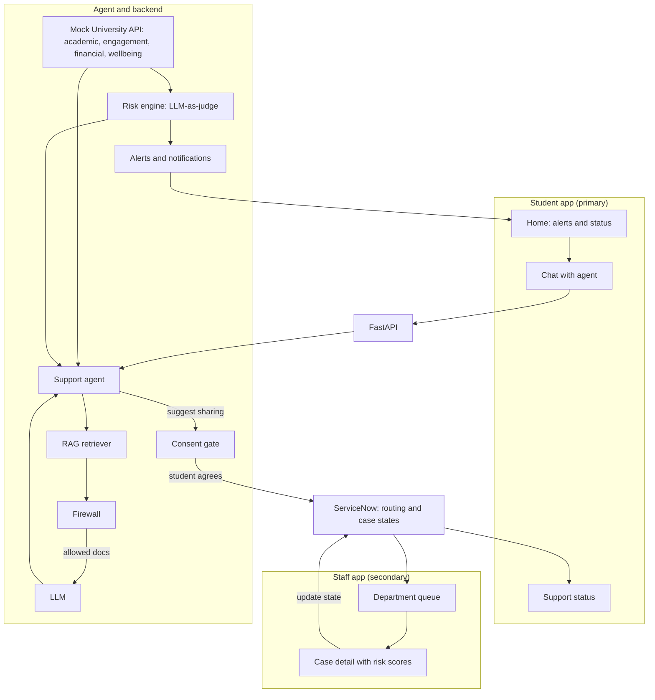

# Student Early-Warning & Support Agent

> An AI support agent that watches a student's academic, engagement, financial and wellbeing signals, warns them early, and, **with the student's consent**, sends the right case to the right department through ServiceNow.

> Replace the title with your project name, and paste the official brief wording into [The Problem](#1-the-problem) if you want it verbatim.

**Contents:** [Problem](#1-the-problem) · [Solution](#2-our-solution) · [Users](#3-users) · [Scope](#4-scope) · [Architecture](#5-architecture) · [Risk model](#6-risk-model) · [Demo](#7-demo-journey) · [Privacy](#8-privacy--responsibility) · [Streams & docs](#9-build-streams--docs) · [Stack & APIs](#10-tech-stack--apis) · [Plan](#11-execution-plan) · [Repo](#12-repo-structure) · [Future](#13-future-scope) · [Team](#14-team)

---

## 1. The Problem

A mid-sized university has a student wellbeing crisis it cannot fully see.

- Mental health referrals are up 40%.
- Support is fragmented across 12 departments.
- Students can wait three weeks for a first appointment.
- Students don't know where to go, support teams work in silos, and the university only sees problems once they become crises.

**Challenge track: Early Warning System.** Identify students who may be struggling before a situation becomes a crisis, using check-ins or behavioural patterns.

**Our focus: one user, one need**

| | |
|---|---|
| **User** | Student 001, a second-year student who is quietly slipping across studies and money and doesn't know who to ask |
| **Need** | Be noticed early and pointed to the right person, without having to navigate 12 departments |

## 2. Our Solution

1. **Data in.** A (mock) university data pipeline gives the agent a student's academics, attendance/engagement, finances and wellbeing check-ins.
2. **Risk out.** An LLM-as-judge risk engine scores each domain, explains why, and raises **alerts**.
3. **Student informed.** The agent tells the student in supportive language, through notifications and chat, and answers questions using the university's support knowledge base.
4. **Student decides.** When a pattern persists, the agent asks: *"You've seemed stressed about coursework for a while. Would you like me to share this with a counsellor?"*
5. **Case routed.** With consent, a ServiceNow case is created and routed: wellbeing → counsellor, money → scholarship & financial-aid officer, studies → academic advisor.
6. **Staff review.** Department staff see the case with risk scores and evidence on the admin side. The student tracks progress.

**Principle: student first, human always.** AI notices, explains and suggests. The student chooses what is shared. Trained staff make the decisions. AI never diagnoses.

## 3. Users

| User | Role | What they do |
|---|---|---|
| **Student** (primary) | Main user | Gets alerts, chats with the agent, consents to sharing, tracks support |
| **Counsellor** (secondary) | Department staff | Reviews wellbeing cases |
| **Scholarship & Financial Aid officer** (secondary) | Department staff | Reviews fees/funding cases |
| **Academic advisor** (secondary) | Department staff | Reviews academic/engagement cases |

## 4. Scope

**Built for the demo (P0)**
- Mock university API with data in four domains
- LLM-as-judge risk engine with scores, evidence, alerts and notifications
- Student chat agent (check-in, questions, support info via RAG)
- Consent-gated case creation → ServiceNow → routing to departments
- Student home, chat and support-status screens
- Department queue and case detail with risk scores
- Firewall demo and an audit trace

**Not now:** real university integrations, more than four risk domains, notifications by email/SMS, service catalog, multi-step ServiceNow workflows, analytics, ML models. See [Future scope](#13-future-scope).

## 5. Architecture



Architecture and API details: [backend doc](docs/agentic-ai-backend.md).

## 6. Risk Model

The risk engine scores **four domains** per student. Each score comes from mock university data, judged by an LLM against a fixed rubric.

| Domain | Example signals (mock) | Routes to |
|---|---|---|
| **Academic** | Marks trend, missed assignments, upcoming deadlines | Academic Advising |
| **Engagement** | Attendance, LMS activity | Academic Advising |
| **Financial** | Fees overdue, funds status, scholarship eligibility | Scholarships & Financial Aid |
| **Wellbeing** | Mood and stress check-ins, self-reported concerns (non-clinical) | Counselling Service |

**Output per domain:** score (0–100), level, evidence, rationale, confidence, suggested action.

| Score | Level | Student sees |
|---|---|---|
| 0–39 | Low | Doing well |
| 40–69 | Medium | Worth watching |
| 70–100 | High | Could use support |

**Overall risk** = highest domain score, plus 10 if two or more domains are Medium or above (compound risk).
**Alert rule:** High now, or Medium or above for 3 consecutive snapshots.
**Trust:** low temperature, structured JSON, evidence must cite input fields, and a simple rules baseline runs alongside as a sanity check and fallback.

## 7. Demo Journey

1. **Student 001 logs in.** Home shows alerts: Wellbeing "worth watching", Financial "could use support".
2. **Opens chat.** The agent starts: *"I noticed you've missed a few assignments and your check-ins have been low this week. Want to talk about it?"*
3. **Talks and asks.** The agent answers with support information and shows its sources.
4. **Consent.** *"Would you like me to share this with a counsellor?"* A card shows exactly what will be shared. Student taps **Yes**.
5. **ServiceNow.** A case is created and routed to the Counselling Service. Same flow for the fees issue → Scholarships & Financial Aid.
6. **Staff side.** Switch to the counsellor: the queue shows only the wellbeing case, with risk score, evidence and AI summary. Counsellor accepts it.
7. **Student view.** Support status updates to "In progress".
8. **Firewall beat.** Student asks for staff-only guidance and it's blocked. The counsellor can't see the financial case.

## 8. Privacy & Responsibility

- **Mock data only.** No real medical or mental-health data. Wellbeing signals are non-clinical.
- **Consent before sharing.** Nothing goes to a department without the student agreeing, and the student sees what will be shared.
- **Data minimisation.** A case carries only its own domain's summary. The counsellor doesn't see finances, and the financial-aid officer doesn't see wellbeing.
- **Firewall.** RAG documents are tagged by audience and filtered before the LLM sees them. For the prototype the agent can read all of the logged-in student's mock data.
- **No diagnosis.** The agent says "may benefit from support", never labels a condition.
- **Safety escalation.** If a message suggests risk of harm, the agent stops the normal flow, shows crisis resources and flags a human immediately.
- **Explainable.** Every score, alert, answer and case has a trace.

## 9. Build Streams & Docs

| Stream | Doc | Owns |
|---|---|---|
| **A. Agentic AI & Backend** | [docs/agentic-ai-backend.md](docs/agentic-ai-backend.md) | Mock data, risk engine, agent, RAG + firewall, APIs, trace |
| **B. Workflow Automation** | [docs/workflow-automation.md](docs/workflow-automation.md) | ServiceNow case, routing, states, API integration |
| **C. Frontend & UX** | [docs/frontend-ux.md](docs/frontend-ux.md) | Student app, staff app, design system |

**Contracts to agree first:** the risk assessment JSON, the case payload, and the status mapping (all in the docs above).

## 10. Tech Stack & APIs

> Proposed defaults. Any stream can swap a component without changing the contracts.

Python + FastAPI · LLM with tool calling (provider configurable) · local vector store (e.g. ChromaDB) · mock data as JSON/SQLite · ServiceNow PDI with Table API · React frontend.

| Audience | Endpoint | Purpose |
|---|---|---|
| Student | `GET /me/overview` | Domain status and alerts |
| Student | `POST /chat` | Talk to the agent |
| Student | `POST /cases` | Create a case (requires consent) |
| Student | `GET /me/cases` | Support status |
| Staff | `GET /staff/cases` | Department queue |
| Staff | `GET /staff/cases/{id}` | Case detail with risk scores |
| Staff | `PATCH /staff/cases/{id}` | Update state |
| Demo | `POST /admin/risk-scan/{student_id}` | Trigger a risk assessment |
| Both | `GET /audit/{trace_id}` | Trace |

## 11. Execution Plan

| Time | A: Backend & Agent | B: Workflow | C: Frontend |
|---|---|---|---|
| 0:00–0:30 | Mock data, risk JSON contract | PDI, case table, groups | Screen skeletons on mock JSON |
| 0:30–1:45 | Risk engine, alerts, chat agent | Routing rule, API tested with curl | Student home and chat |
| 1:45–3:00 | Consent gate, case API, RAG + firewall | State sync | Consent card, support status, staff queue |
| 3:00–3:45 | **Integrate everything**, trace, fallbacks | Test the flow | Case detail, states, polish |
| 3:45–4:00 | Demo rehearsal | | |

**Cut order if time runs short:** trace drawer polish → second case type (financial) → staff case-detail extras → cohort views. **Never cut:** risk scoring, consent gate, ServiceNow round trip.

## 12. Repository Structure

```
.
├── README.md
├── docs/
│   ├── agentic-ai-backend.md
│   ├── workflow-automation.md
│   └── frontend-ux.md
├── backend/
│   ├── app/            # routes, schemas
│   ├── university_api/ # mock data + pipeline-shaped API
│   ├── risk/           # LLM judge, rules baseline, alerts
│   ├── agent/          # tools, prompts, consent gate
│   ├── rag/            # ingestion, retriever, firewall
│   └── data/
├── servicenow/         # config notes, sample payloads
├── frontend/
└── tests/
```

**Run:** `uvicorn app.main:app --reload` (backend) · `npm run dev` (frontend). Env vars: `LLM_API_KEY`, `SERVICENOW_INSTANCE`, `SERVICENOW_USER`, `SERVICENOW_PASSWORD`. Demo logins: `student_001`, `counsellor_01`, `finaid_01`.

## 13. Future Scope

- Real university data pipeline integrations (SIS, LMS, finance)
- Joined-up case management across all 12 departments
- More risk domains and longitudinal trend analysis
- Email/SMS notifications and student-set preferences
- Service catalog and richer ServiceNow workflows
- Cohort-level analytics for the university
- Consent management dashboard

## 14. Team

| Stream | Member | Role |
|---|---|---|
| A | _Name_ | Agent & orchestration |
| A | _Name_ | Backend, risk engine & knowledge |
| B | _Name_ | Automation workflow |
| B | _Name_ | ServiceNow integration |
| C | _Name_ | Student experience |
| C | _Name_ | Staff experience & integration |
