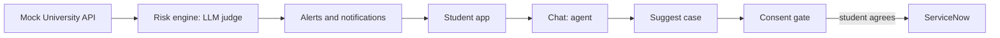

# Stream A: Agentic AI & Backend

[← README](../README.md) · [Workflow →](workflow-automation.md) · [Frontend →](frontend-ux.md)

**Priority:** **P0** must work in demo · **P1** should have · **P2** stretch.

## Objective

Build the intelligence layer: read (mock) university data, judge risk across domains, raise alerts, talk to the student, and turn a **consented** suggestion into a structured case for ServiceNow.

## Flow



## 1. Mock University API and Data (P0)

A module shaped like a real university pipeline so it can be swapped later. The agent reads through it, and for the prototype **all of the logged-in student's mock data is accessible**.

| Domain | Fields (mock, non-clinical) |
|---|---|
| Academic | marks for last 3 assessments, missed assignments, upcoming deadlines |
| Engagement | attendance %, LMS logins per week |
| Financial | fees due, days overdue, funds status, scholarship eligibility |
| Wellbeing | mood and stress check-in scores (1–5), self-reported concerns |

Each student has a short history of snapshots (e.g. 14 daily snapshots) so trends and persistence can be computed. Create **Student 001** with a full storyline: assignments missed, mood low all week, fees overdue. Add 6–8 other students as background.

## 2. Risk Engine: LLM-as-Judge (P0)

For each domain the judge receives the current and recent snapshot data plus a rubric, and returns:

```json
{
  "student_id": "S001",
  "domain": "wellbeing",
  "score": 68,
  "level": "MEDIUM",
  "confidence": 0.8,
  "evidence": ["Mood check-ins averaged 2.1/5 over 7 days", "3 assignments missed this month"],
  "rationale": "Sustained low mood alongside falling academic activity.",
  "suggested_action": "Offer a conversation with the Counselling Service",
  "suggested_department": "Counselling Service"
}
```

**Levels:** 0–39 LOW · 40–69 MEDIUM · 70–100 HIGH.
**Overall risk:** highest domain score, +10 if two or more domains are MEDIUM or above (cap 100).
**Alert rule:** HIGH now, or MEDIUM+ for 3 consecutive snapshots.

**Making the judge dependable**
- One rubric per domain, low temperature, JSON schema validation
- Evidence must quote input fields; reject and retry if missing
- A simple **rules baseline** (threshold checks per domain) runs alongside: it's the sanity check, and the fallback if the LLM call fails
- Never use diagnostic wording; wellbeing output says "may benefit from support"

**Alerts and notifications (P0):** when the alert rule fires, store an alert `{id, student_id, domain, level, message, created_at, read}`. The student app shows it on Home and the agent references it when the chat opens. Messages are supportive and plain ("Worth watching", never "high risk").

Trigger for the demo: `POST /admin/risk-scan/{student_id}` (also run once at startup for seeded students).

## 3. Support Agent (P0)

A tool-calling agent for the student chat. It can run a light check-in, answer questions about the student's own data, explain alerts, retrieve support information, and suggest sharing a case.

| Tool | Purpose | Guardrail |
|---|---|---|
| `get_my_data(domain)` | Read the student's mock data | Own data only |
| `get_risk_profile()` | Latest judge output and alerts | Own data only |
| `search_support_kb(query)` | RAG over support docs | Always through the firewall |
| `suggest_case(domain, summary)` | Prepare a case proposal for the student | Proposal only |
| `create_case(...)` | Create the ServiceNow case | **Requires consent token from the student** |
| `get_my_cases()` | Case status | Read-only |
| `escalate_to_human()` | Urgent handoff | Used for safety triggers |

**Behaviours**
- Opens the chat with context if there is an unread alert.
- Uses the **consent flow**: suggest → show what would be shared → student taps Yes / Not now → only then `create_case`.
- Never diagnoses, never promises outcomes, never creates a case on its own.
- **Safety escalation:** if the message suggests risk of harm, stop the normal flow, show crisis resources, and call `escalate_to_human()`.
- Session context is kept in memory per `session_id` (selected alert, recent turns, pending case proposal).

## 4. RAG + Firewall (P0)

**Knowledge base:** about 8 short docs: Academic Support, Tutoring, Counselling Service intro, Scholarships and Financial Aid, Fee payment support, Attendance support, plus 2 **staff-only** docs (e.g. internal triage guidelines).

**Pipeline:** chunk → embed → retrieve top-k → **firewall** → build context → answer with citations.

**Firewall:** a separate module, not a prompt rule. Each chunk carries `audience: student | staff`. After retrieval, chunks not allowed for the caller's role are dropped **before** the LLM sees them. It returns `allowed` docs and a `blocked_count`.

**Second use:** the staff API returns only cases belonging to the caller's department, and a case only contains its own domain's data.

## 5. API Layer (P0)

| Audience | Endpoint | Purpose |
|---|---|---|
| Student | `GET /me/overview` | Domain status (friendly levels) and alerts |
| Student | `POST /chat` | Agent conversation |
| Student | `POST /cases` | Create case (needs consent object) |
| Student | `GET /me/cases` | Case status |
| Staff | `GET /staff/cases` | Department queue |
| Staff | `GET /staff/cases/{id}` | Detail with risk scores and evidence |
| Staff | `PATCH /staff/cases/{id}` | Update state (calls ServiceNow) |
| Demo | `POST /admin/risk-scan/{student_id}` | Run the judge |
| Both | `GET /audit/{trace_id}` | Trace |

Demo auth: `X-User-Id` and `X-Role` headers (`student`, `counsellor`, `finaid`, `advisor`).

## 6. Structured Outputs (P0)

Chat responses have a type, so the UI knows what to render:

```json
{
  "type": "message | consent_request | blocked | escalation | fallback",
  "text": "string",
  "sources": [{"doc_id": "string", "title": "string"}],
  "blocked_count": 0,
  "consent_request": null,
  "trace_id": "string"
}
```

`consent_request` (for `consent_request` type):

```json
{
  "domain": "wellbeing",
  "department": "Counselling Service",
  "shared_summary": "Low mood check-ins for a week and missed coursework.",
  "shared_fields": ["mood check-ins (7 days)", "missed assignments"],
  "not_shared": ["financial information", "other domains"]
}
```

Case payload sent on `POST /cases` and forwarded to ServiceNow:

```json
{
  "student_id": "S001",
  "domain": "wellbeing",
  "category": "Wellbeing",
  "priority": "High",
  "risk_score": 68,
  "risk_level": "MEDIUM",
  "evidence": ["..."],
  "ai_summary": "string",
  "consent": {"given": true, "timestamp": "...", "scope": "wellbeing"},
  "trace_id": "T-0042"
}
```

## 7. Fallbacks (P0)

| Situation | Behaviour |
|---|---|
| LLM judge fails or invalid JSON | Retry once, then use rules baseline and mark `source: baseline` |
| ServiceNow call fails | Keep the proposal, tell the student it wasn't sent, allow retry; never claim success |
| Low-confidence retrieval | Say the sources don't cover it and suggest speaking to a person |
| Restricted content requested | `blocked` response with count only |
| Safety trigger | `escalation` response, crisis resources, human flagged |

## 8. Trace (P0)

One record per interaction: actor, role, tools called, documents retrieved / authorized / blocked / sent to LLM, risk assessment IDs used, whether a case was created and the consent reference. Feeds the trace view in the staff case detail and the "why am I seeing this" explanation.

## 9. Testing (P1)

Only what protects the demo:
1. **Risk judge:** Student 001 comes out MEDIUM or HIGH in wellbeing and financial; a stable student comes out LOW.
2. **Firewall:** a staff-only doc never appears in the LLM prompt.
3. **Consent gate:** `create_case` fails without consent.
4. **Routing payload:** each domain maps to the right department.
5. **End to end:** alert → chat → consent → ServiceNow case.

## Two-Member Split

**Member 1: Agent & Orchestration**
Agent, tools, prompts, consent flow, session context, safety escalation, chat response types.

**Member 2: Backend, Risk Engine & Knowledge**
Mock data and API, risk engine (judge, rules baseline, alerts), RAG + firewall, endpoints, trace, tests.

## Definition of Done

- [ ] Mock data seeded; risk scan produces scores, evidence and alerts
- [ ] Chat opens with the alert and answers with sources
- [ ] Consent card → case created in ServiceNow
- [ ] Firewall blocks a staff-only doc and the trace shows it
- [ ] Safety phrase triggers escalation
