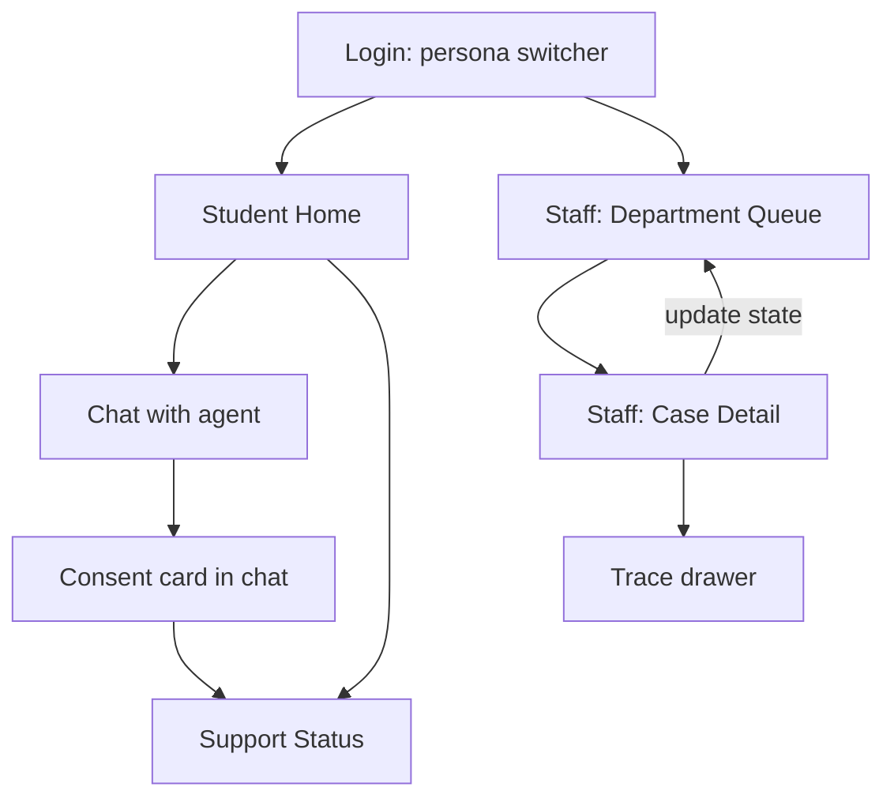

# Stream C: Frontend & UX

[← README](../README.md) · [Backend →](agentic-ai-backend.md) · [Workflow →](workflow-automation.md)

**Priority:** **P0** must work in demo · **P1** should have · **P2** stretch.

## Objective

Build a **student-first** experience that feels supportive rather than surveilling: the student is noticed early, talks to an agent that understands their situation, chooses what to share, and can see what happens next. A smaller **staff app** lets department staff review the cases that reach them.

## Design Principles

1. **Supportive, not clinical.** Students see "Doing well / Worth watching / Could use support", never scores or the word "risk".
2. **The student is in control.** Every share is a visible choice with a clear "what's shared / what's not" summary.
3. **Show the why.** Alerts and answers say what they're based on.
4. **Calm by default.** Alerts are gentle, one concern at a time, with a clear next step.
5. **Staff get evidence, not mystery.** Scores always come with evidence.
6. **Never rely on colour alone.** Levels use colour, icon and text.

## Screen Map



**Student app:** Home · Chat (with consent card) · Support Status
**Staff app:** Department Queue · Case Detail (with trace drawer)
**Login:** a demo persona switcher (`student_001`, `counsellor_01`, `finaid_01`); no real auth.

## Student Screens

### 1. Student Home (P0)

*Question it answers: how am I doing, and is there anything I should know?*

```
┌──────────────────────────────────────────┐
│ Hi Student 001                           │
│                                          │
│ 💬 A note from your support agent        │
│ "I've noticed a few things worth a chat" │
│                     [ Talk to me ]       │
│                                          │
│ How you're doing                         │
│ Studies       ● Worth watching           │
│ Attendance    ● Doing well               │
│ Money         ▲ Could use support        │
│ Wellbeing     ● Worth watching           │
│                                          │
│ Your support                             │
│ Wellbeing · Received → [View]            │
└──────────────────────────────────────────┘
```

- Alert card (from `GET /me/overview`) with a primary action that opens the chat with that alert as context
- Four domain chips with friendly level labels, icon and colour
- "Your support" list showing active cases and status
- Empty state: "All good. We'll let you know if anything comes up."

### 2. Chat with Agent (P0)

*The main student experience.*

```
┌──────────────────────────────────────────┐
│ Support agent                            │
│                                          │
│ Agent: I noticed you've missed a few     │
│ assignments and your check-ins have been │
│ low this week. Want to talk about it?    │
│                                          │
│            You: Yeah, it's been a lot    │
│                                          │
│ Agent: That sounds hard. Here are some   │
│ options that might help…                 │
│ Sources: ✓ Academic Support Guide        │
│                                          │
│ ┌──────────────────────────────────────┐ │
│ │ Share with the Counselling Service?  │ │
│ │ Shared: mood check-ins, missed work  │ │
│ │ Not shared: finances, other areas    │ │
│ │ [ Yes, share ] [ Not now ]           │ │
│ └──────────────────────────────────────┘ │
│ [ Type a message…                  ➤ ]   │
└──────────────────────────────────────────┘
```

Render by response `type`:

| Type | UI |
|---|---|
| `message` | Bubble, with **Sources** chips if present |
| `consent_request` | **Consent card** (below) |
| `blocked` | Shield notice: "I can't share that. It's restricted." |
| `escalation` | Calm, prominent card with crisis resources and "a person will follow up" |
| `fallback` | Plain message with a suggested next step |

**Consent card (P0):** a distinct component inside the chat, showing department, shared summary, shared fields and **not-shared** list, with **Yes, share** and **Not now**. After Yes: loading, then a confirmation with the case number and department. If ServiceNow fails: "It didn't send. Try again?" and the proposal stays.

Quick-reply chips for common actions (P1): "Check my attendance", "What support is there?", "Do I qualify for a scholarship?"

### 3. Support Status (P0)

```
Wellbeing support · Counselling Service
● Received  ─ ○ In progress ─ ○ Resolved

Next: A counsellor will get in touch.
Shared: mood check-ins, missed work
```

- Timeline: Received → In progress → Resolved (plus "Action needed from you" if waiting)
- Shows what was shared and with whom
- Never shows scores, evidence or staff notes

## Staff Screens

### 4. Department Queue (P0)

- Shows **only cases for the logged-in department**
- Row: case number, student, domain, **risk badge (score + level)**, state
- Filter by state (P1)

### 5. Case Detail (P0)

```
Case WEL0000124 · Student 001 · Wellbeing
Risk 68 · MEDIUM · Confidence 0.8

Evidence
• Mood check-ins averaged 2.1/5 over 7 days
• 3 assignments missed this month

AI summary
Sustained low mood alongside falling academic activity.

Consent ✓ given by student, 14:02
[ Accept ]  [ Mark in progress ]  [ Resolve ]
                              [ View trace ▸ ]
```

- Risk score with level and evidence
- AI summary (domain-only, matching data minimisation)
- Consent stamp
- Actions call `PATCH /staff/cases/{id}`
- **Trace drawer (P1):** tools used, documents retrieved / authorized / blocked, risk assessment used

Demo point: a counsellor sees no financial data, and the financial-aid officer sees no wellbeing data.

## Components (build once, reuse)

| Component | Used in |
|---|---|
| `DomainChip` (label + icon + colour) | Home, staff detail |
| `AlertCard` | Home |
| `ChatBubble`, `SourceChips`, `TypingIndicator` | Chat |
| `ConsentCard` | Chat |
| `StatusTimeline` | Support Status |
| `RiskBadge` (score + level) | Queue, detail |
| `CaseRow`, `EvidenceList` | Staff |
| `EmptyState`, `ErrorState`, `Skeleton` | Everywhere |

**Level styling:** Low = green + check, Medium = amber + eye, High = coral + heart-hand or arrow (no red alarm styling for students). Staff can use the same palette plus numbers.

## UX States (P0)

| State | Handling |
|---|---|
| Loading | Skeletons on Home/Queue; typing indicator in chat |
| Empty | Friendly copy on Home, Status and Queue |
| Error | Plain message + retry, never raw errors |
| Consent failure | Proposal preserved, retry offered |
| Restricted | Shield notice in chat |
| Safety escalation | Dedicated calm card, distinct from normal messages |

## API Integration

| Screen | Endpoints |
|---|---|
| Home | `GET /me/overview`, `GET /me/cases` |
| Chat | `POST /chat`; `POST /cases` on consent |
| Support Status | `GET /me/cases` |
| Queue | `GET /staff/cases` |
| Case Detail | `GET /staff/cases/{id}`, `PATCH /staff/cases/{id}`, `GET /audit/{trace_id}` |

Start with **mock JSON matching the agreed shapes** from the [backend doc](agentic-ai-backend.md#6-structured-outputs) so nothing is blocked, then switch to live endpoints at integration.

## Tone & Copy Guidelines

- Warm, plain language; short sentences.
- Say "worth watching" and "could use support", never "at risk" or "flagged".
- Offer, don't tell: "Would you like me to…", never "We have reported…".
- Always say what happens next.

## Possible Two-Member Split

**Member 1: Student Experience**
Home, Chat (bubbles, sources, consent card, escalation card), Support Status, student-side states and tone.

**Member 2: Staff Experience & Integration**
Login switcher, Department Queue, Case Detail, trace drawer, API integration, shared components and final polish.

## Definition of Done

- [ ] Student Home shows alerts and friendly domain status
- [ ] Chat opens from an alert, shows sources, renders the consent card
- [ ] Consenting creates a case and Support Status reflects it
- [ ] Counsellor and financial-aid logins each see only their own cases with scores and evidence
- [ ] Loading, error, restricted and escalation states render cleanly
