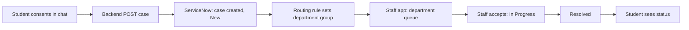

# Stream B: Workflow Automation (ServiceNow), Baseline

[← README](../README.md) · [Backend →](agentic-ai-backend.md) · [Frontend →](frontend-ux.md)

**Priority:** **P0** must work in demo · **P1** should have · **P2** stretch.

## Objective

Take a **student-consented** case from the agent, create it in ServiceNow, route it to the right department, and keep its state in sync so staff and the student can see progress.

Deliberately small. Staff review and update cases in **our staff app**, which reads and writes ServiceNow through the backend. ServiceNow is the system of record, and its native list view is the backup proof in the demo.

## Flow

## 1. Case Record (P0)

One custom table, `u_student_support_case`, extending `Task` so state, priority, assignment group and number come built in. Fallback: use `incident` with the same custom fields.

| Field | Notes |
|---|---|
| `number` | Auto, e.g. `WEL0000124` |
| `student_id` | Mock student ID |
| `domain` | academic · engagement · financial · wellbeing |
| `risk_score`, `risk_level` | From the judge |
| `evidence` | Text: key evidence lines |
| `ai_summary` | Summary for staff (domain-only) |
| `consent_given`, `consent_time` | Consent record |
| `trace_id` | Link to backend trace |
| `student_status` | Student-friendly label (set by rule) |

Built-in Task fields used: `priority`, `state`, `assignment_group`, `assigned_to`, `short_description`.

## 2. Routing (P0)

One Business Rule on insert: domain → assignment group.

| Domain | Assignment group |
|---|---|
| Wellbeing | Counselling Service |
| Financial | Scholarships & Financial Aid |
| Academic | Academic Advising |
| Engagement | Academic Advising |

Priority default: risk HIGH → High, MEDIUM → Medium. Staff assignment within a group is manual.

## 3. States and Student Status (P0)

| ServiceNow state | Student sees |
|---|---|
| New | Received |
| In Progress | In progress |
| Resolved | Resolved |
| Waiting for Student *(P1)* | Action needed from you |

A second Business Rule on state change updates `student_status`, so the frontend never interprets raw states.

## 4. Integration (P0)

ServiceNow **Table API** with a service account.

| Action | Call |
|---|---|
| Create case | `POST /api/now/table/u_student_support_case` |
| Read case | `GET /api/now/table/u_student_support_case/{sys_id}` |
| List by group | `GET /api/now/table/u_student_support_case?sysparm_query=assignment_group=...` |
| Update state | `PATCH /api/now/table/u_student_support_case/{sys_id}` |

Payload comes from the backend case payload in the [backend doc](agentic-ai-backend.md#6-structured-outputs). The backend refuses to call ServiceNow without a consent object. The staff app sees updated state on refresh or short polling.

## 5. Staff Access (P1)

Keep it simple: two or three demo users (`counsellor_01`, `finaid_01`) mapped to their assignment groups. Visibility is enforced by the backend, which only returns cases for the caller's group. Real ServiceNow roles and ACLs are future scope.

## 6. Testing (P0)

| Test | Expected |
|---|---|
| Create via API | Record exists with all fields |
| Routing | Wellbeing → Counselling Service, Financial → Scholarships & Financial Aid |
| State change | `student_status` updates to match the table |
| Consent gate | Backend refuses to create without consent |
| End to end | Consent in chat → case in ServiceNow → visible in staff queue → state change → student view updates |

## Out of Scope (future)

Notifications, service catalog, SLAs, escalations, multi-team workflows, ServiceNow ACL/role design, the full 12-department ecosystem.

## Two-Member Split

**Member 1: Automation Workflow**
Case table and fields, groups, routing rule, state rule, `student_status` mapping.

**Member 2: Integration**
Table API calls from the backend, service account, sample payloads, staff state updates, end-to-end testing and demo data.

## Definition of Done

- [ ] Consented case from the backend appears in ServiceNow, routed to the correct group
- [ ] Staff state change in the staff app updates ServiceNow and the student's status
- [ ] ServiceNow list view shows the same case (backup proof)
